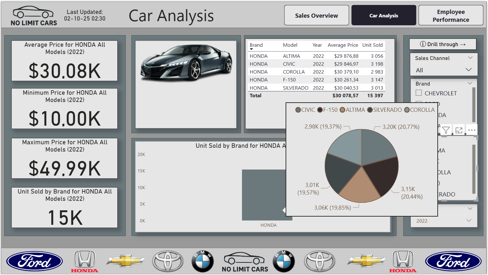
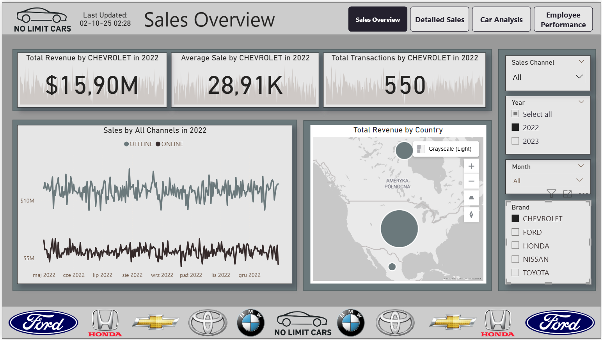
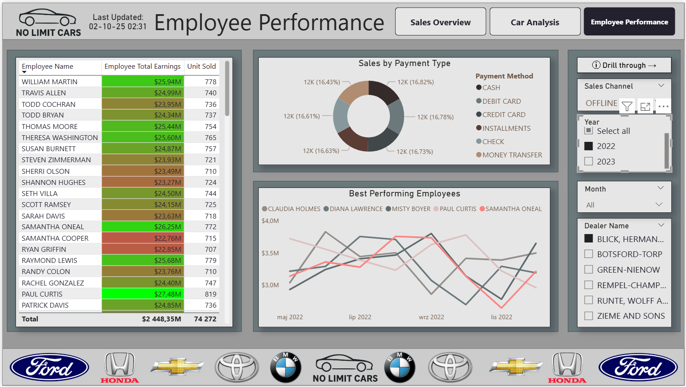
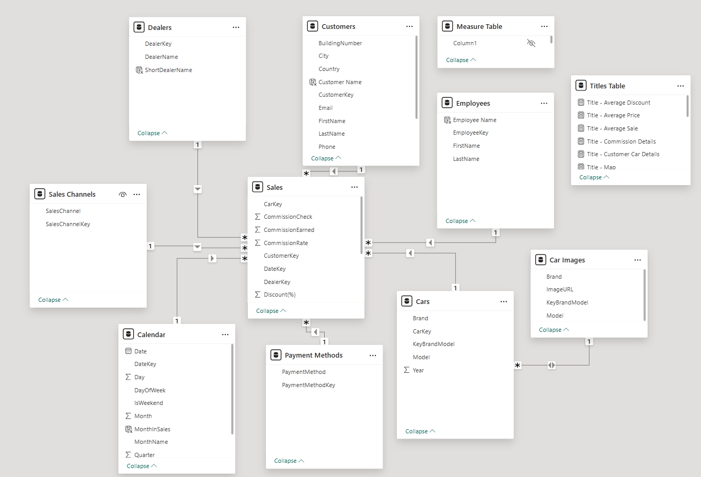

# Car Sales Dashboard – Power BI Analytics  
<p align="center">  
    
</p>  

## Introduction  
The **Car Sales Dashboard** is an interactive **Power BI report** built on top of the **DWH Car Sales Data Mart**.  
It provides real-time insights into car sales performance across multiple channels, helping decision-makers monitor KPIs, analyze trends, and evaluate profitability.  

The dashboard connects directly to the **dimensional model (star schema)** of the Data Warehouse, ensuring optimized queries and reliable data quality.  

[View DWH Repository](https://github.com/IvanFilipchuk/DWH_Car_Sales)  

## Key Features  
- **Star Schema Data Model** with central fact table (`FCT_SALES`) and key dimensions.  
- **Dynamic KPIs & Titles** adapting to user filters and selections.  
- **Multi-page report structure** with overview, detailed analysis, and drillthrough pages.  
- **Navigation bar & bookmarks** for intuitive user experience.  
- **Car Images & Titles Table** for enhanced visuals and contextualized charts.  
- **Role-based usability**: tailored insights for Sales Directors, Managers, Analysts, and Executives.  

---

## Business Process & Purpose  
The company monitors sales across both **online** and **offline** channels, focusing on:  
- Car model profitability  
- Employee and dealer performance  
- Customer preferences  
- Regional sales trends  

**Report Purpose:** Enable fast business decision-making through clear visualization of sales KPIs.  
**Target Users:**  
- Sales Director  
- Regional Managers  
- Data Analysts  
- Executive Team  

**Key Business Questions:**  
1. What is the sales trend over time?  
2. Which car models are most profitable?  
3. Which sales channels generate the highest revenue?  
4. Who are the top-performing employees?  
5. What is the payment method distribution?  
6. Which regions show the highest sales activity?  

---

## Report Structure  

### Page 1: Sales Overview  
This is the main dashboard page providing a high-level sales summary:  
- KPI Cards (Revenue, Avg Sale, Transactions)  
- Sales Trend by channel (Online vs Offline)  
- Map with sales distribution by country  
- Units sold by brand (bar chart with conditional formatting)  
- Top dealers performance table  
- Filters: Year, Brand, Sales Channel  

<p align="center">  
    
</p>  

---

### Page 2: Cars Analysis  
Detailed analysis of car models:  
- Car image visualization  
- KPIs (Avg Price, Units Sold, Min/Max Price)  
- Price distribution (histogram)  
- Units sold by brand/model (bar chart)  
- Performance table with metrics  
- Dynamic titles & context filters  

<p align="center">  
    
</p>  

---

### Page 3: Employee Performance  
Focus on employee and dealer performance:  
- Earnings and units sold per employee  
- Payment method distribution (donut chart)  
- Top performers ranking table  
- Filters: Brand, Year, Dealer  

<p align="center">  
    
</p>  

---

### Hidden Pages  

**Employee Details** – transaction-level analysis by employee.  

**Customer Details** – customer-specific purchase history.  

**Detailed Sales** – advanced breakdown of discounts, commissions, and revenue.  

---

## Data Model  

The data model follows a **star schema**:  

- **Fact Table:** `FCT_SALES` (partitioned by date)  
- **Dimensions:**  
  - `DIM_DATES` – calendar with extended attributes  
  - `DIM_CARS` – brand, model, year hierarchy  
  - `DIM_CUSTOMERS_SDC` – SCD Type 2 historical customer data  
  - `DIM_DEALERS`, `DIM_EMPLOYEES`, `DIM_PAYMENT_METHODS`, `DIM_SALES_CHANNELS`  

<p align="center">  
    
</p>  

---

## Data Preparation & Transformations  
- Imported tables: DIM_DATES, DIM_CARS, DIM_DEALERS, DIM_PAYMENT_METHODS, DIM_SALES_CHANNELS, DIM_CUSTOMERS_SDC, DIM_EMPLOYEES, FCT_SALES.  
- Steps applied:  
  - Removed source system columns.  
  - Renamed for clarity.  
  - Standardized data types.  
  - Created calculated columns for year, employee/customer full names.  

---

## DAX Calculations  

**Calculated Columns:**  
- YearInSales (Calendar table)  
- Full Name (Employees, Customers)  

**Measures:**  
- `Total Sales = SUM(FCT_SALES[SALE_PRICE])`  
- `Average Sale = AVERAGE(FCT_SALES[SALE_PRICE])`  
- `Sales Count = COUNTROWS(FCT_SALES)`  

**Dynamic Titles (example):**  
```DAX
Title - Average Sale = "Average Sale for " & SELECTEDVALUE(DIM_CARS[BRAND], "All Brands") & " in " & SELECTEDVALUE(DIM_DATES[YearInSales], "All Years")
```
---

## Summary  

The **Car Sales Dashboard** enables a complete view of dealership sales performance, powered by the custom-built **Car Sales Data Warehouse**.  
It supports strategic decision-making through advanced visualizations and real-time KPIs.  

For the ETL pipeline and Data Warehouse implementation, check the repository here:  
[Car Sales DWH – PostgreSQL ETL Project](https://github.com/IvanFilipchuk/DWH_Car_Sales)  

---
